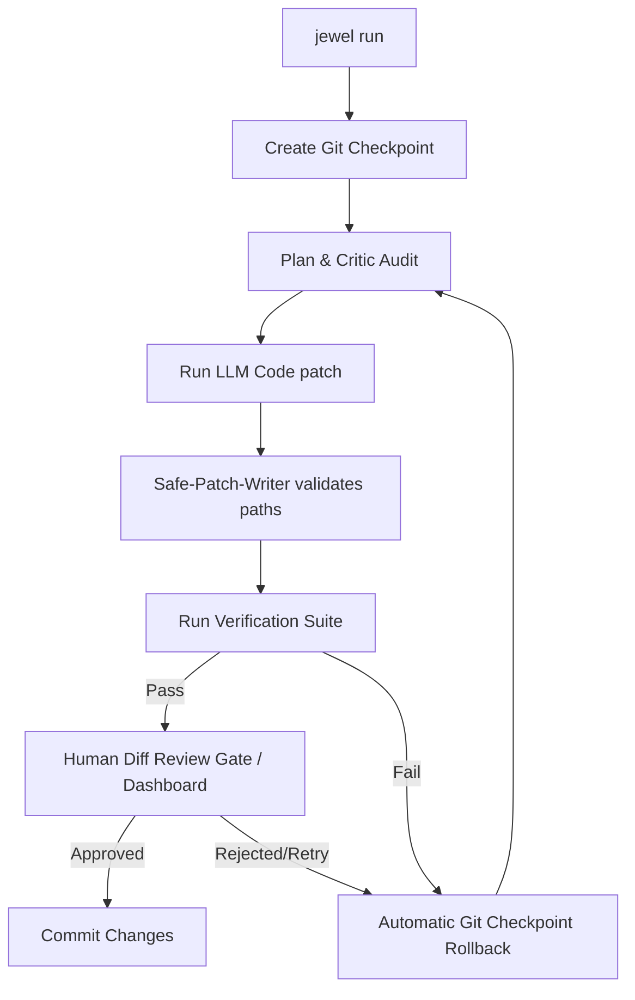

<div align="center">
  
```text
  ___    _____   \ \    /  \    / /   _____    _     
 |_  |  |  ___|   \ \  / /\ \  / /   |  ___|  | |    
   | |  | |__      \ \/ /  \ \/ /    | |__    | |    
_  | |  | |___     \  /    \  /      | |___   | |___ 
\__/ |  |_____|    \/      \/        |_____|  |_____|
```
  
  **Jewel is an autonomous, task-based AI coder that writes code and runs tests inside a secure transactional safety harness.**

  [](https://www.npmjs.com)
  [](https://github.com/vinoth2vinoth/Jewel/actions)
  [](./LICENSE)
  [](#)

  *Jewel is an autonomous AI coding agent. It takes your high-level tasks, designs implementation plans, generates precise code patches, and validates changes inside a strict sandboxed Git transaction loop with automatic rollback safety.*
</div>

## 📖 Table of Contents
- [What Jewel IS / IS NOT](#what-jewel-is--is-not)
- [🔄 How the Safety Loop Works](#-how-the-safety-loop-works)
- [🚀 Quick Start](#-quick-start)
- [🖥️ Local Web UI Dashboard (`--ui`)](#️-local-web-ui-dashboard---ui)
- [⚙️ Configuration Reference (`jewel.config.json`)](#️-configuration-reference-jewelconfigjson)
- [🤖 Supported Models & Providers](#-supported-models--providers)
- [🔒 Safety & Security Model](#-safety-security-model)
  - [Sandboxed LLM Code Execution](#sandboxed-llm-code-execution)
  - [Path Escape Prevention & Workspace Boundary Protection](#path-escape-prevention--workspace-boundary-protection)
  - [Budget Guards & Cost Limits](#budget-guards--cost-limits)
- [🛠️ Custom Safety Skills](#️-custom-safety-skills)
- [💻 CLI Command & Option Reference](#-cli-command--option-reference)
- [❓ Frequently Asked Questions (FAQ)](#-frequently-asked-questions-faq)
- [🔍 Troubleshooting & Diagnostics](#-troubleshooting--diagnostics)
- [🧪 Dogfooding Demo Project](#-dogfooding-demo-project)
- [🤝 Contributing & License](#-contributing--license)

---

## What Jewel IS / IS NOT

When you let LLMs write code directly in your local repository, they can overwrite critical configuration files, trigger runaway token bills, introduce compile errors, or run destructive shell tests.

**Jewel** is an autonomous AI coding agent designed to operate inside a strict, transactional safety harness. When given a natural language task, Jewel creates an ephemeral Git checkpoint of your workspace, plans and generates code patches using your configured LLM provider, executes your compilation and test suites inside isolated Docker sandboxes, and automatically rolls back all changes to your original files if any test fails.

### What Jewel IS:
- **Autonomous AI Coding Agent**: Takes natural language tasks, performs file-scope analysis, drafts design plans, writes target code patches, and reviews code correctness.
- **Git Transaction Manager**: Snapshots the workspace prior to code modifications and automates rolling back your repository if verification tests fail.
- **Docker Sandbox Isolation**: Safely executes tests and build commands in secure, network-isolated container environments to prevent host system pollution or execution of dangerous shell commands.
- **Path Escape Prevention**: Normalizes patch files and blocks absolute routes, directory traversals (`..`), UNC paths, and null bytes before editing.
- **Budget Guards & Cost Tracking**: Calculates token expenses in real-time, immediately aborting the task run if LLM costs exceed your session budget.
- **Local Web UI Dashboard**: Serves an interactive SSE dashboard showing live logs, AST interface signature diff trees, and manual patch selection checklists.

### What Jewel IS NOT:
- **An interactive conversational chat loop assistant (like Claude Code or Aider)**: Jewel is a command-driven task execution agent. It does not run interactive multi-turn chat loops in your terminal; it accepts a task, generates a safe patch, runs tests, and exits.
- **A replacement for Git**: Jewel builds on top of Git for atomic checkpoint rollbacks.
- **A sandbox-only executor**: By default, verification scripts run on the host. To isolate untrusted test executions, you must set `"useSandbox": true` in your configuration.

---

## 🔄 How the Safety Loop Works

Jewel coordinates plan review, patch writes, testing, and approval in a strict transaction loop:



---

## 🚀 Quick Start

### Prerequisites
- **Node.js**: `v18.x` or higher (Node `v20.x+` recommended).
- **Git**: Git installed and initialized in target directory (strongly recommended for fast checkpointing).
- **Docker**: Docker installed and active (optional, required if running tests inside a sandboxed container).

### User Installation

Install Jewel globally with a single command:

#### Option A: Direct Installation from GitHub (Recommended for latest dev builds)
Since Jewel is under active development, you can install the latest release directly from GitHub:
```bash
npm install -g https://github.com/vinoth2vinoth/Jewel
```
*Note: This command automatically fetches the repository and compiles the TypeScript code in one step.*

#### Option B: Global Registry Installation
Alternatively, if installing from the npm registry:
```bash
npm install -g jewel-cli
```

#### Option C: Zero-Install (On-the-fly execution via npx)
Run tasks on the fly without installing Jewel permanently:
```bash
npx -p https://github.com/vinoth2vinoth/Jewel jewel run "fix the failing math test" --mock
```

> [!IMPORTANT]
> **Windows CMD Environment Variable Tip**: When setting environment variables (like `GEMINI_API_KEY`) in CMD, use `set GEMINI_API_KEY=your_key_here` without quotes. Wrapping the value in quotes (e.g., `set GEMINI_API_KEY="key"`) forces Windows to ingest the quotes literally into Node's environment parser, causing authentication failures.

### Get Started in 3 Steps:

1. **Initialize configuration** in your project directory:
   ```bash
   jewel init
   ```
2. **Verify environment setup** and diagnostics:
   ```bash
   jewel doctor
   ```
3. **Execute a task** in mock mode (safe simulation without API calls):
   ```bash
   jewel run "Fix formatting in code" --mock --files "src/index.ts"
   ```

---

## 🖥️ Local Web UI Dashboard (`--ui`)

Jewel features a zero-dependency local Web UI dashboard. Instead of verifying patches via command line prompts, developers can monitor runs from their browser.

To launch the dashboard alongside your task:
```bash
jewel run "Implement arithmetic add helper" --ui
```

### Dashboard Capabilities:
1. **Live Event Stream (SSE)**: Plan audits, shell outputs, and test logs stream live to the browser.
2. **Interactive Decision Modal**: Approve, reject, override, or request retries directly.
3. **AST Tree Diff Explorer**: Renders structural changes (additions vs deletions of class/function/type signatures) inside a collapsible details tree.
4. **Selective Patch Checklist**: Checkboxes allow you to choose which file changes to apply. Reverting unselected files is done programmatically before validation.
5. **Cumulative API Cost Gauge**: A visual SVG-based progress circle shows prompt/completion token count and total USD cost relative to your configured session limit.

---

## ⚙️ Configuration Reference (`jewel.config.json`)

Configure your safety parameters inside `jewel.config.json` at the root of your workspace:

```json
{
  "projectName": "My App",
  "mode": "strict",
  "maxRetries": 3,
  "maxFilesChanged": 8,
  "maxLinesChanged": 500,
  "requirePlanBeforeEdit": true,
  "requireVerificationBeforeDone": true,
  "allowNewDependencies": false,
  "allowProtectedFileChanges": false,
  "allowGitPush": false,
  "provider": "none",
  "model": "",
  "temperature": 0.0,
  "maxOutputTokens": 4000,
  "maxSessionCost": 0.0,
  "commands": {
    "lint": "npm run lint",
    "typecheck": "npm run typecheck",
    "test": "npm test",
    "build": "npm run build",
    "e2e": ""
  },
  "protectedFiles": [
    ".env",
    ".env.local",
    ".env.*",
    "package-lock.json",
    "src/auth/**",
    "src/payments/**"
  ],
  "dangerousCommandPolicy": "block",
  "reportFormat": ["markdown", "json"],
  "auditSpawnedProcesses": true,
  "interactiveRetryMode": true,
  "useASTDiffGuard": false,
  "useSandbox": false,
  "sandboxNetwork": "none",
  "sandboxReadOnlyRoot": true,
  "sandboxWritePaths": []
}
```

### Key Configuration Field Definitions

| Field | Type | Default | Description |
|---|---|---|---|
| `projectName` | `string` | `"My App"` | Name/Title of the workspace for logs, dashboards, and pre-launch reports. |
| `mode` | `string` | `"strict"` | Safety enforcement mode (`strict` blocks preflight failures; `lax` allows warnings). |
| `maxRetries` | `number` | `3` | Maximum verification auto-retry attempts before marking the task as failed. |
| `maxFilesChanged` | `number` | `8` | Maximum number of files allowed to be modified in a single session. |
| `maxLinesChanged` | `number` | `500` | Maximum lines modified across all files in a single session. |
| `requirePlanBeforeEdit` | `boolean` | `true` | Forces LLM to write design plans to `memory/plans/` before applying edits. |
| `requireVerificationBeforeDone` | `boolean` | `true` | Requires all verification checks to pass successfully before prompting commit. |
| `allowNewDependencies` | `boolean` | `false` | Allows the LLM patch to introduce new external dependencies into `package.json`. |
| `allowProtectedFileChanges` | `boolean` | `false` | Allows writes to files matching patterns inside the `protectedFiles` array. |
| `allowGitPush` | `boolean` | `false` | Allows Jewel to automatically push finalized commits to the upstream remote. |
| `provider` | `string` | `"none"` | LLM connection adapter (`none` for dry-run/mocks, `openai`, `gemini`, `anthropic`, `openrouter`). |
| `model` | `string` | `""` | Base model selector name (e.g., `gpt-4o-mini`, `gemini-1.5-flash`). |
| `temperature` | `number` | `0.0` | Model generation temperature (recommended `0.0` for deterministic outputs). |
| `maxOutputTokens` | `number` | `4000` | Maximum token limit allowed in provider API responses. |
| `maxSessionCost` | `number` | `0.0` | **Budget Guard**. Aborts execution if cumulative USD token cost exceeds this amount. `0.0` is disabled. |
| `commands` | `object` | *See block* | Map of key verification commands executed during preflight checks (`lint`, `typecheck`, `test`, `build`, `e2e`). |
| `protectedFiles` | `string[]` | *See block* | Glob patterns of files protected from modification by default (e.g., `.env`, `package-lock.json`). |
| `dangerousCommandPolicy` | `string` | `"block"` | Shell safety policy for script executions (`block` stops run, `warn` alerts, `allow` proceeds). |
| `reportFormat` | `string[]` | `["markdown", "json"]` | File outputs generated after each session under `.jewel/reports/`. |
| `auditSpawnedProcesses` | `boolean` | `true` | Audits process trees spawned by unit tests to flag unrecognized network/filesystem activity. |
| `interactiveRetryMode` | `boolean` | `true` | Prompts developers for interactive feedback/retry choices on command line on verification failures. |
| `useASTDiffGuard` | `boolean` | `false` | Blocks commits if the patch alters class/function interfaces or signatures. |
| `useSandbox` | `boolean` | `false` | Enables **sandboxed LLM code execution** by isolating all verification commands inside Docker containers. |
| `sandboxNetwork` | `string` | `"none"` | Docker container network mode (`none` blocks outbound connection for exfiltration protection). |
| `sandboxReadOnlyRoot` | `boolean` | `true` | Mounts target workspace root as read-only (`:ro`) in Docker container. |
| `sandboxWritePaths` | `string[]` | `[]` | Directories inside workspace granted read-write container mounting permissions. |

---

## 🤖 Supported Models & Providers

Jewel integrates with major LLM providers. Adapters validate capabilities (such as Structured Output support and system prompts) before invoking API endpoints.

### Capability Matrix

| Provider | Recommended Model(s) | Structured Outputs | Usage Metrics | Cost Tracking | Notes |
| :--- | :--- | :---: | :---: | :---: | :--- |
| **gemini** | `gemini-1.5-flash`<br>`gemini-1.5-pro`<br>`gemini-2.0-flash`<br>`gemini-2.5-flash` | Yes | Yes | Yes | Highly cost-efficient; Gemini adapter strips incompatible schema parameters (`$schema`, `additionalProperties`). |
| **openai** | `gpt-4o-mini`<br>`gpt-4o`<br>`gpt-4-turbo` | Yes | Yes | Yes | Supports JSON schemas format natively. Older models like `gpt-3.5-turbo` are restricted as they lack strict schema formats. |
| **anthropic** | `claude-3-5-sonnet-20241022`<br>`claude-3-5-haiku-20241022`<br>`claude-3-opus-20240229` | Yes | Yes | Yes | Uses Anthropic tool choice mapping to enforce structured patches. |
| **openrouter** | `openai/gpt-4o-mini`<br>`anthropic/claude-3.5-sonnet` | Yes | Yes | Yes | Routes calls and resolves model endpoints to underlying providers dynamically. |

---

## 🔒 Safety & Security Model

### Sandboxed LLM Code Execution
To protect your host machine from arbitrary code execution during verification (e.g. running unit tests or custom build scripts written by an LLM), Jewel supports running verification commands inside secure Docker containers. 
- Mounts the project root read-only (`:ro`).
- Grants write permissions exclusively to designated folders (`sandboxWritePaths`).
- Network access is disabled by default (`sandboxNetwork: "none"`) to prevent private code and credentials from leaking.

> [!WARNING]
> Running Jewel without **sandboxed LLM code execution** (`useSandbox: false`) executes verification commands directly on your host shell. Only turn sandboxing off if you fully trust the LLM completions or are running in a mock sandbox environment.

### Path Escape Prevention & Workspace Boundary Protection
All proposed edits undergo rigorous path audits in [safe-patch-writer.ts](./src/safety/safe-patch-writer.ts) to prevent traversal, escaping, and directory-clobbering attacks:
- **Path Normalization**: Windows backslashes `\` are converted to forward slashes `/` before audits to prevent platform-specific check bypasses.
- **Null Byte Guard**: Rejects segment strings containing null bytes (`\0`).
- **Workspace Containment**: Absolute paths (including Windows drive prefixes `C:`), UNC paths (`\\`), and parent directory traversals (`..`) are blocked.
- **Transactional Writes**: Patches are applied atomically. If any file write fails, the entire change is rolled back.

### Budget Guards & Cost Limits
Jewel estimates LLM execution costs in real-time according to registered model token prices. If the cumulative cost of planning, patching, and critic reviews exceeds `maxSessionCost`, the Budget Guard immediately aborts the run and rolls back all changes to prevent runaway API spend.

---

## 🛠️ Custom Safety Skills

You can define custom safety rules using **Safety Skills**. These are local Markdown files containing bulleted rules that Jewel merges into the LLM context to enforce codebase-specific rules.

Skills are loaded from `.jewel/skills/<skill_name>/SKILL.md`.

**Example Skill (`.jewel/skills/database-safety/SKILL.md`):**
```markdown
---
name: database-safety
description: Enforce safe migration and schema alteration patterns
---

- Do not modify database schemas without writing a corresponding rollback migration script.
- Never write raw SQL queries; always use parameterized queries to prevent injection.
- Do not modify files under the `migrations/` directory directly.
```

---

## 💻 CLI Command & Option Reference

### Commands
| Command | Usage | Description |
|---|---|---|
| `init` | `jewel init` | Initialize default configuration, `AGENTS.md` rules, and baseline safety skills. |
| `run` | `jewel run "<task>"` | Start a task wrapped in a session contract, git checkpoint, and verification check. |
| `verify` | `jewel verify` | Manually trigger verification commands defined in config. |
| `diff` | `jewel diff [session-id]`| Show proposed edits and diff previews for a session. |
| `status` | `jewel status` | Display the current active session, checkpoint metadata, and repo status. |
| `rollback` | `jewel rollback [session-id]` | Revert the workspace to the state at the start of the specified session (**git checkpoint rollback**). Defaults to the latest session if omitted. |
| `audit` | `jewel audit` | Perform safety check verification on configuration and reports. |
| `doctor` | `jewel doctor` | Diagnoses local env setup (Node, Git, package managers, and configured API keys). |
| `provider-ready`| `jewel provider-ready`| Verifies provider integration config and checks capability registry. |
| `smoke-provider`| `jewel smoke-provider`| Run a quick network connectivity and capability check on the configured provider (accepts `--provider` and `--model` overrides). |
| `release-check`| `jewel release-check`| Run public package release checklist and secret redaction audit. |
| `version` | `jewel version` | Prints the current package version and system info. |

### Options & Flags
| Option | Arguments | Description |
|---|---|---|
| `-f, --files` | `<list>` | Comma-separated list of target files for the task scope contract. |
| `-m, --mock` | *None* | Runs task using local mock adapter for dry-run simulation (forces provider to `none`). |
| `--dry-run` | *None* | Perform preflight check, print task contract, and exit without invoking LLM or writing patches. |
| `--yes` | *None* | Auto-approve planning and patch stages without prompting for human intervention. |
| `--no-review` | *None* | Disables the visual HTML diff review step. |
| `--keep-failed` | *None* | Bypasses automatic **git checkpoint rollback** if verification tests fail. |
| `--ui` | *None* | Launches the interactive local Web UI dashboard at http://127.0.0.1:3000. |
| `--provider` | `<provider>` | Override the LLM provider configuration (`openai`, `gemini`, `anthropic`, `openrouter`). |
| `--model` | `<model>` | Override the model name configuration (e.g. `gpt-4o-mini`). |
| `--temperature` | `<temp>` | Override the sampling temperature setting (e.g. `0.2`). |
| `--max-output-tokens`| `<tokens>` | Override the maximum output token limit. |

---

## ❓ Frequently Asked Questions (FAQ)

### How is Jewel different from coding assistants like Aider or Claude Code?
* **Aider / Claude Code**: These are active, conversational editing agents. They manage chat context windows, request model edits, and sometimes run shell tests. They focus on *generation*.
* **Jewel**: Jewel is an **AI coding safety harness** and execution-layer shield. It does not interact in conversation. Instead, it wraps LLM/agent code proposals in transactional checkpoints, enforces file scopes, normalizes paths, redacts secrets, and automatically performs a **git checkpoint rollback** if tests fail.

### Does Jewel execute raw shell scripts?
Only if they are defined inside your project's `jewel.config.json` configuration block under `commands` (e.g. `npm test`). Jewel will reject arbitrary command executions if `dangerousCommandPolicy` is set to `"block"`.

### Does Jewel send my files or telemetry to third parties?
No. Jewel operates 100% locally. It has **zero built-in telemetry** and sends zero data to external monitoring servers. File contexts are only sent directly to your configured LLM API provider via official client libraries (OpenAI, Gemini, Anthropic, or OpenRouter).

---

## 🔍 Troubleshooting & Diagnostics

### Git Repository Detection Failures
If you receive the warning: `Harness warning: Git repository not initialized...`:
* **Cause**: Jewel uses Git for automated branch-free checkpointing (`git commit` to a local, temporary safety reference branch).
* **Fix**: Run `git init` and make at least one commit in your project directory before executing `jewel run`. Ensure that your global git credentials (`user.name` and `user.email`) are configured.

### Docker Container Sandbox Failures
If running `useSandbox: true` fails or hangs:
* **Cause**: Docker is either inactive, or the current user lacks permissions to interact with the Docker socket (`/var/run/docker.sock` on Linux or Docker Desktop on Windows).
* **Fix**: Verify that Docker is running (`docker info` in terminal). If Docker is not available and you want tests to run directly on the host shell, set `"sandboxFallbackToHost": true` or `"useSandbox": false` in your configuration to disable **sandboxed LLM code execution**.

### Budget Guards Aborting Runs
If you receive the error `[Jewel Budget Guard] Session cost limit exceeded...`:
* **Cause**: The accumulated prompt and output tokens used during planning, patching, and critic reviews exceeded the `maxSessionCost` limit defined in `jewel.config.json`.
* **Fix**: Increase the limit in `jewel.config.json` (e.g., set to `0.05` for a 5-cent budget, or `0.0` to disable the **budget guards**), or run with a cheaper model like `gemini-1.5-flash` or `gpt-4o-mini`.

---

## 🧪 Dogfooding Demo Project

We have included a small broken project under `examples/dogfood-broken-project`. You can use it to verify the harness:

1. Navigate to the dogfood project:
   ```bash
   cd examples/dogfood-broken-project
   ```
2. Build the project:
   ```bash
   npm install && npm run build
   ```
3. Run tests (verify that they fail out-of-the-box):
   ```bash
   npm test
   ```
4. Run Jewel to automatically resolve the issue:
   ```bash
   jewel run "fix the failing math test" --mock --files src/math.ts --yes
   ```
5. Observe that Jewel creates a checkpoint, applies a deterministic patch to `src/math.ts`, runs verification tests (which now pass), and stages a clean git commit.

---

## 🤝 Contributing & License

For details on contributing code, styling guidelines, and opening pull requests, please read the [CONTRIBUTING.md](./CONTRIBUTING.md) and [SECURITY.md](./SECURITY.md) guidelines.

Licensed under the [MIT License](./LICENSE). Copyright (c) 2026 Vinoth Kumar.
