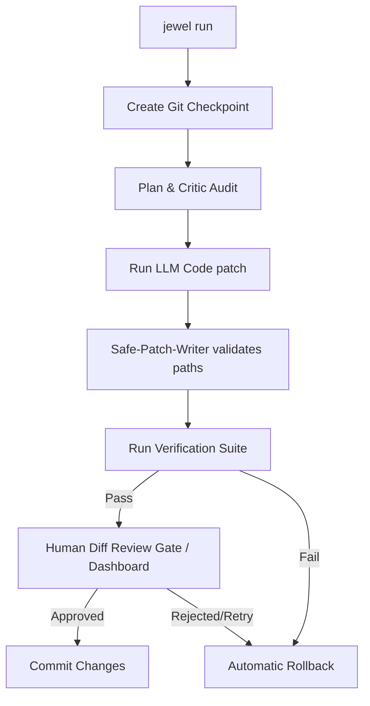

<div align="center">
  
```text
      ____  _____ _      _____ _      
     / __ \| ____| |    |  ___| |     
    | |  | | |__ | |    | |__ | |     
    | |  | |  __|| |    |  __|| |     
    | |__| | |___| |____| |___| |____ 
     \____/|_____|______|_____|______|
```
  
  **Strict, Verification-First AI Coding Safety Harness CLI**

  [](https://www.npmjs.com)
  [](https://github.com/vinoth2vinoth/Jewel/actions)
  [](./LICENSE)
  [](#)

  *Jewel is a strict, verification-first AI coding harness CLI designed to force AI agents to follow disciplined software engineering principles, prevent runaway costs, and protect developer workspaces.*
</div>

---

> [!IMPORTANT]
> **Branding Notice**: Jewel is Karpathy-inspired (strict, simple, surgical, test-verified) but is *not* officially affiliated with or endorsed by Andrej Karpathy.

---

## 📖 Table of Contents
- [What Jewel IS / IS NOT](#what-jewel-is--is-not)
- [🔄 How the Safety Loop Works](#-how-the-safety-loop-works)
- [🚀 Quick Start](#-quick-start)
- [🖥️ Local Web UI Dashboard (`--ui`)](#️-local-web-ui-dashboard---ui)
- [⚙️ Configuration Reference (`jewel.config.json`)](#️-configuration-reference-jewelconfigjson)
- [🔒 Safety & Security Model](#-safety-security-model)
  - [Docker Sandboxing](#docker-sandboxing)
  - [Path Escape & Boundary Protection](#path-escape--boundary-protection)
  - [Budget Guard & Cost Limits](#budget-guard--cost-limits)
- [🛠️ Custom Safety Skills](#️-custom-safety-skills)
- [💻 CLI Command & Option Reference](#-cli-command--option-reference)
- [🧪 Dogfooding Demo Project](#-dogfooding-demo-project)
- [🤝 Contributing & License](#-contributing--license)

---

## What Jewel IS / IS NOT

### What Jewel IS:
- **A verification-first AI coding safety harness**: Jewel wraps LLM executions in transactional checkpoints, diff guards, and verification tests.
- **A transaction manager**: Automatically snapshot-checks workspace files via Git commits or copy snapshots, and performs a complete rollback to the checkpoint if verification tests fail.
- **Provider-neutral**: Implements a capability-aware adapter registry supporting OpenAI, Gemini, Anthropic, OpenRouter, and local dry-run modes.
- **Safe-patch-writer protected**: All code changes are validated for path escapes, absolute routes, Windows drive prefix traversal, and null bytes before editing.
- **Human-review friendly**: Serves an interactive local Web UI review modal with side-by-side git diffs, AST signature difference trees, and selective patch checklists.

### What Jewel IS NOT:
- **An autonomous agent loop (like Claude Code)**: Jewel does not manage conversational chat loops. It is the *safety execution layer* that wraps patch proposals to ensure they compile, pass tests, and are approved before staging.
- **A replacement for git**: Jewel builds on top of git for snapshotting.
- **A loose sandbox fallback**: Jewel does not blindly execute test scripts on the host unless sandboxing is explicitly disabled.

---

## 🔄 How the Safety Loop Works

Jewel coordinates plan review, patch writes, testing, and approval in a strict transaction loop:



---

## 🚀 Quick Start

### Prerequisites
- **Node.js**: `v18.x` or higher (Node `v20.x+` recommended).
- **Git**: Git installed and initialized in target directory (strongly recommended for fast checkpointing).
- **Docker**: Docker installed and active (optional, required if running tests inside a sandboxed container).

### User Installation
1. Pack the local repository:
   ```bash
   npm pack
   ```
   This generates a tarball file (e.g. `jewel-cli-0.9.0.tgz`).
2. Install the package globally from the local tarball:
   ```bash
   npm install -g ./jewel-cli-*.tgz
   ```
3. Initialize configuration in your coding project:
   ```bash
   jewel init
   ```
4. Verify environment setup and configuration:
   ```bash
   jewel doctor
   ```
5. Run a task with the mock adapter (safe dry-run simulation):
   ```bash
   jewel run "Fix formatting in code" --mock --files "src/index.ts"
   ```

---

## 🖥️ Local Web UI Dashboard (`--ui`)

Jewel features a zero-dependency local Web UI dashboard. Instead of verifying patches via command line prompts, developers can monitor runs from their browser.

To launch the dashboard alongside your task:
```bash
jewel run "Implement arithmetic add helper" --ui
```

### Dashboard Capabilities:
1. **Live Event Stream (SSE)**: Plan audits, shell outputs, and test logs stream live to the browser.
2. **Interactive Decision Modal**: Approve, reject, override, or request retries directly.
3. **AST Tree Diff Explorer**: Renders structural changes (additions vs deletions of class/function/type signatures) inside a collapsible details tree.
4. **Selective Patch Checklist**: Checkboxes allow you to choose which file changes to apply. Reverting unselected files is done programmatically before validation.
5. **Cumulative API Cost Gauge**: A visual SVG-based progress circle shows prompt/completion token count and total USD cost relative to your configured session limit.

---

## ⚙️ Configuration Reference (`jewel.config.json`)

Configure your safety parameters inside `jewel.config.json` at the root of your workspace:

```json
{
  "projectName": "My App",
  "mode": "strict",
  "maxRetries": 3,
  "maxFilesChanged": 8,
  "maxLinesChanged": 500,
  "requirePlanBeforeEdit": true,
  "requireVerificationBeforeDone": true,
  "allowNewDependencies": false,
  "allowProtectedFileChanges": false,
  "allowGitPush": false,
  "provider": "none",
  "model": "",
  "temperature": 0.0,
  "maxOutputTokens": 4000,
  "maxSessionCost": 0.0,
  "commands": {
    "lint": "npm run lint",
    "typecheck": "npm run typecheck",
    "test": "npm test",
    "build": "npm run build",
    "e2e": ""
  },
  "protectedFiles": [
    ".env",
    ".env.local",
    ".env.*",
    "package-lock.json",
    "src/auth/**",
    "src/payments/**"
  ],
  "dangerousCommandPolicy": "block",
  "reportFormat": ["markdown", "json"],
  "auditSpawnedProcesses": true,
  "interactiveRetryMode": true,
  "useASTDiffGuard": false,
  "useSandbox": false,
  "sandboxNetwork": "none",
  "sandboxReadOnlyRoot": true,
  "sandboxWritePaths": []
}
```

### Key Configuration Field Definitions

| Field | Type | Default | Description |
|---|---|---|---|
| `mode` | `string` | `"strict"` | Safety level. In `strict` mode, exceeding changed file limits or missing plans immediately blocks task commits. |
| `maxFilesChanged` | `number` | `8` | Maximum number of files an agent can modify in one session. |
| `maxLinesChanged` | `number` | `500` | Maximum lines modified limit before triggering a preflight check block. |
| `allowProtectedFileChanges`| `boolean`| `false` | If false, blocks any writes to paths matching `protectedFiles` patterns. |
| `dangerousCommandPolicy` | `string` | `"block"` | Policy for shell executions. Can be `"block"` (stops execution), `"warn"` (warns and logs), or `"allow"`. |
| `provider` | `string` | `"none"` | LLM adapter provider (`none`, `openai`, `gemini`, `anthropic`, `openrouter`). |
| `model` | `string` | `""` | Base model name (e.g. `gpt-4o-mini`, `gemini-1.5-flash`). |
| `temperature` | `number` | `0.0` | Sampling temperature. `0.0` is recommended for deterministic JSON patches. |
| `maxSessionCost` | `number` | `0.0` | **Budget Guard**. Maximum cumulative USD cost allowed for a single task run. `0.0` disables budget checks. |
| `useSandbox` | `boolean` | `false` | Enable Docker container isolation for verification commands. |
| `sandboxNetwork` | `string` | `"none"` | Network configuration for verification containers (defaults to `"none"` to prevent exfiltration). |
| `sandboxReadOnlyRoot` | `boolean` | `true` | Mounts the project root workspace read-only inside the container to prevent unauthorized filesystem modification. |
| `sandboxWritePaths` | `string[]`| `[]` | Directories in the workspace granted write permission (mounted `:rw`) during sandbox verification. |

---

## 🔒 Safety & Security Model

### Docker Sandboxing
To protect your host machine from arbitrary code execution during verification (e.g. running unit tests or custom build scripts written by an LLM), Jewel supports running verification commands inside secure Docker containers. 
- Mounts the project root read-only (`:ro`).
- Grants write permissions exclusively to designated folders (`sandboxWritePaths`).
- Network access is disabled by default (`sandboxNetwork: "none"`) to prevent private code and credentials from leaking.

> [!WARNING]
> Running Jewel with `useSandbox: false` executes verification commands directly on your host shell. Only turn sandboxing off if you fully trust the LLM completions or are running in a mock sandbox environment.

### Path Escape & Boundary Protection
All proposed edits undergo rigorous path audits in [safe-patch-writer.ts](./src/safety/safe-patch-writer.ts) to prevent traversal, escaping, and directory-clobbering attacks:
- **Path Normalization**: Windows backslashes `\` are converted to forward slashes `/` before audits to prevent platform-specific check bypasses.
- **Null Byte Guard**: Rejects segment strings containing null bytes (`\0`).
- **Workspace Containment**: Absolute paths (including Windows drive prefixes `C:`), UNC paths (`\\`), and parent directory traversals (`..`) are blocked.
- **Transactional Writes**: Patches are applied atomically. If any file write fails, the entire change is rolled back.

### Budget Guard & Cost Limits
Jewel estimates LLM execution costs in real-time according to registered model token prices. If the cumulative cost of planning, patching, and critic reviews exceeds `maxSessionCost`, the Budget Guard immediately aborts the run and rolls back all changes to prevent runaway API spend.

---

## 🛠️ Custom Safety Skills

You can define custom safety rules using **Safety Skills**. These are local Markdown files containing bulleted rules that Jewel merges into the LLM context to enforce codebase-specific rules.

Skills are loaded from `.jewel/skills/<skill_name>/SKILL.md`.

**Example Skill (`.jewel/skills/database-safety/SKILL.md`):**
```markdown
---
name: database-safety
description: Enforce safe migration and schema alteration patterns
---

- Do not modify database schemas without writing a corresponding rollback migration script.
- Never write raw SQL queries; always use parameterized queries to prevent injection.
- Do not modify files under the `migrations/` directory directly.
```

---

## 💻 CLI Command & Option Reference

### Commands
| Command | Usage | Description |
|---|---|---|
| `init` | `jewel init` | Initialize default configuration, `AGENTS.md` rules, and baseline safety skills. |
| `run` | `jewel run "<task>"` | Start a task wrapped in a session contract, git checkpoint, and verification check. |
| `verify` | `jewel verify` | Manually trigger verification commands defined in config. |
| `diff` | `jewel diff [session-id]`| Show proposed edits and diff previews for a session. |
| `status` | `jewel status` | Display the current active session, checkpoint metadata, and repo status. |
| `rollback` | `jewel rollback` | Revert the workspace to the state at the start of the latest session. |
| `audit` | `jewel audit` | Perform safety check verification on configuration and reports. |
| `doctor` | `jewel doctor` | Diagnoses local env setup (Node, Git, package managers, and configured API keys). |
| `provider-ready`| `jewel provider-ready`| Verifies provider integration config and checks capability registry. |
| `release-check`| `jewel release-check`| Run public package release checklist and secret redaction audit. |
| `version` | `jewel version` | Prints the current package version and system info. |

### Options & Flags
- `-f, --files <list>`: Comma-separated list of files likely needed for the task contract.
- `-m, --mock`: Use mock agent adapter to apply deterministic patches locally (forces provider to `none`).
- `--yes`: Auto-approve planning and patch proposal stages without waiting for human review.
- `--no-review`: Disable visual diff review step.
- `--keep-failed`: Prevent automatic snapshot rollback if verification or human review fails.
- `--ui`: Launch the interactive local Web UI dashboard (starts at http://127.0.0.1:3000).

---

## 🧪 Dogfooding Demo Project

We have included a small broken project under `examples/dogfood-broken-project`. You can use it to verify the harness:

1. Navigate to the dogfood project:
   ```bash
   cd examples/dogfood-broken-project
   ```
2. Build the project:
   ```bash
   npm install && npm run build
   ```
3. Run tests (verify that they fail out-of-the-box):
   ```bash
   npm test
   ```
4. Run Jewel to automatically resolve the issue:
   ```bash
   jewel run "fix the failing math test" --mock --files src/math.ts --yes
   ```
5. Observe that Jewel creates a checkpoint, applies a deterministic patch to `src/math.ts`, runs verification tests (which now pass), and stages a clean git commit.

---

## 🤝 Contributing & License

For details on contributing code, styling guidelines, and opening pull requests, please read the [CONTRIBUTING.md](./CONTRIBUTING.md) and [SECURITY.md](./SECURITY.md) guidelines.

Licensed under the [MIT License](./LICENSE). Copyright (c) 2026 Vinoth Kumar.
