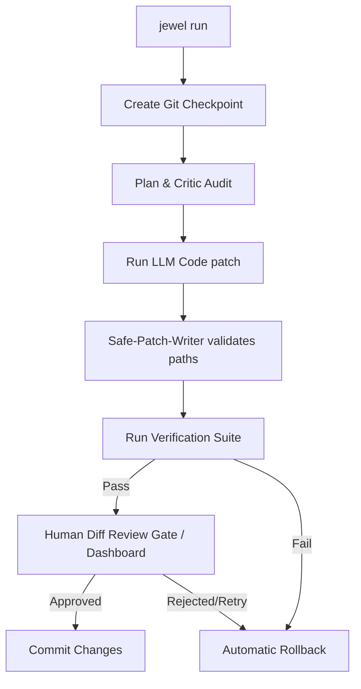

# Design Plan: Jewel README.md & Documentation Enhancements (Public Release)

This design plan details the complete rewrite and enhancement of `README.md` to prepare Jewel for a premium, open-source public launch. It resolves absolute local file link leaks, conflated user vs developer onboarding flows, missing CLI option blocks, and undocumented safety features (such as Docker sandboxing, budget guards, custom safety skills, and the local Web UI dashboard).

---

## 1. Objectives & Key Improvements

1. **Fix Absolute File Links**: Replace hardcoded `file:///C:/Users/vinot/...` paths with clean repository-relative Markdown links.
2. **Premium Visual Identity**: Add a central ASCII banner logo at the top and include standard shields.io badges for npm, GitHub build workflow status, coverage, and license.
3. **Interactive Flow Diagram**: Add a Mermaid flowchart showing the complete transaction loop (Contract -> Checkpoint -> Proposal -> Verification -> Human Approval / Dashboard -> Commit or Rollback).
4. **Document Undocumented Safety Features**:
   - **Local Web UI Dashboard**: Add documentation for the zero-dependency browser dashboard, SSE logic, and interactive decisions.
   - **Docker Sandboxing**: Document how to isolate execution tests inside a read-only root Docker container with restricted network access.
   - **Budget Guard**: Document the `maxSessionCost` budget limiter to prevent runaway token costs.
   - **Custom Safety Skills**: Explain the YAML structure, rules parser, and path layouts (`.jewel/skills/`).
5. **Configuration Matrix**: Document the configuration keys in `jewel.config.json` with a clear reference table.
6. **Detailed CLI Reference Matrix**: Add all missing commands (`diff`, `provider-ready`) and flags (`--dry-run`, `--keep-failed`, `--yes`, `--no-review`, `--ui`).
7. **Clean Installation Separation**: Separate quickstarts (tarball or global use) from developer contribution guides.

---

## 2. Affected Files

1. `README.md`: Complete rewrite of document contents according to domain audit reports.
2. `LICENSE`: Create standard MIT License file.
3. `CONTRIBUTING.md`: Create guidelines for open-source contributors.
4. `SECURITY.md`: Create security vulnerability reporting disclosure instructions.

---

## 3. Implementation Details & Plan

### A. Add Repository Logo & Badges
Introduce clean center alignment, SVG badges, and a custom ASCII text header:
```text
      ____  _____ _      _____ _      
     / __ \| ____| |    |  ___| |     
    | |  | | |__ | |    | |__ | |     
    | |  | |  __|| |    |  __|| |     
    | |__| | |___| |____| |___| |____ 
     \____/|_____|______|_____|______|
    
       Strict AI Coding Safety Harness CLI
```

### B. Add Mermaid Lifecycle Loop


### C. Separate Setup Tracks
- **User Installation**:
  ```bash
  npm pack
  npm install -g ./jewel-cli-*.tgz
  jewel init
  jewel doctor
  ```
- **Local Dev / Contribution**:
  ```bash
  git clone https://github.com/vinoth2vinoth/Jewel.git
  npm install
  npm run build
  npm test
  ```

### D. Complete Options & Commands Matrix
Include `jewel diff`, `jewel provider-ready`, and all parameter flags (e.g. `--dry-run`, `--ui`, `--keep-failed`).

---

## 4. Auditing & Testing Verification
1. Run `npm run build` to ensure project build is intact.
2. Run `npm test` to verify all test suites pass.
3. Execute `node dist/cli/index.js release-check` to verify the public release checklist remains fully compliant with 0 errors.
